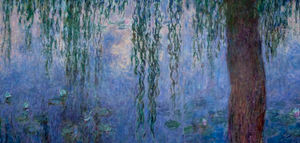

# Copying Artistic Style with CNN

## Creating the environment
> source venv/bin/activate
(venv)> python
Python 3.7.4 (default, Jul  9 2019, 18:13:23) 
[Clang 10.0.1 (clang-1001.0.46.4)] on darwin
Type "help", "copyright", "credits" or "license" for more information.
>>> import tensorflow as tf
>>> print(tf.__version__)
1.15.0
>>> import scipy
>>> print(scipy.__version__)
1.3.1
>>> ctrl-D

## Running the Code
(venv)> python paint.py
(venv)> deactivate
