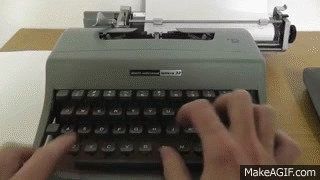

# Generating Text with LSTM
These notebooks construct an GRU which learns to generate new text from scratch based on the content you supply. It works really well on an amazing array of text sources. I ran this on my Mac (i.e. no GPU) and it built a pretty good Shakespeare generator in about 40 minutes. 

## The environment
Requirements: 
- python3
- tensorflow 2.0
- jupyter

## Running the code
These are jupyter notebooks you can just run. 
- You can use the shakespeare or raymond chandler versions provided.
- Supply an example phrase in the last cell to generate some text.
- Make sure you change the output folder or you will overwrite your previous work

## Experiments
- Supply your own text and adjust the settings to build your own generator (should be at least 1M of text).
- Play with the sequence length, batch size, RNN units, increase training EPOCHS
- Create new windows with new prompts (i.e. starter words) to get different results
